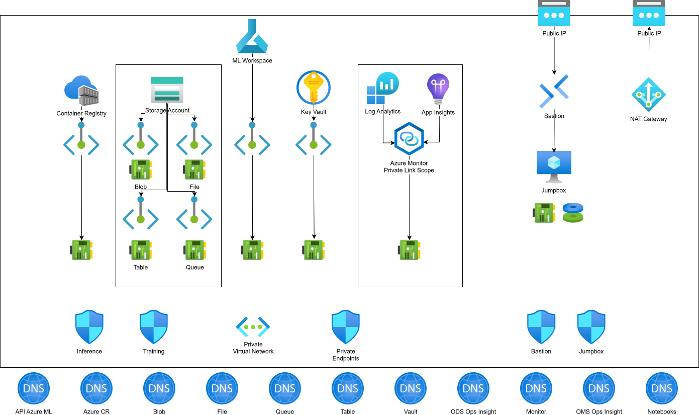

# Azure ML Private Network Project

## Project Goal

Build a secure Azure Machine Learning (Azure ML) Workspace using **only** private link and private endpoint connections for network communication. This ensures that the workspace and its associated resources are not exposed to the public internet.

## Architecture Overview

The infrastructure is deployed using **Terraform**, leveraging **Azure Verified Modules (AVM)** where applicable.



### Key Components

1. **Networking**
   * **Virtual Network (VNet)**: The backbone of the private network.
   * **Subnets**: Dedicated subnets for:
     * Private Endpoints (for Azure services).
     * Training Compute (Azure ML Compute Clusters).
     * Inference Compute (if applicable).
   * **Private DNS Zones**: To resolve private endpoint IP addresses.

2. **Storage**
   * **Azure Storage Account**: Stores datasets and code.
   * **Private Endpoints**: Enabled for `blob` (data) and `file` (code mounting).
   * **Code Management**: Training scripts and inference code will be mounted from Azure Files/Blob rather than baked into container images.

3. **Container Registry**
   * **Azure Container Registry (ACR)**: Stores Docker images (Triton, vLLM).
   * **Private Endpoint**: Ensures images are pulled over the private network.

4. **Security**
   * **Azure Key Vault**: Stores secrets and keys.
   * **Private Endpoint**: Secure access to secrets.

5. **Azure ML Workspace**
   * **Workspace**: The central hub for ML activities.
   * **Private Endpoint**: Disables public access to the workspace.
   * **Compute**:
     * **Compute Instance**: Used for development. Configured with a **User Assigned Identity** to ensure secure access to storage and container registries without public access.
     * **Compute Cluster**: Used for training jobs. Configured with auto-scaling.

## Deployment

### Repository Layout

This repo is split into two Terraform runs:

* [bootstrap](bootstrap) - Creates the dedicated state storage account in a separate resource group.
* [infra](infra) - Deploys the Azure ML private network stack using the remote backend.

### Prerequisites

* Terraform >= 1.5.0
* Azure CLI
* An Azure Subscription

### Configuration

#### Bootstrap configuration

1. Copy [bootstrap/terraform.tfvars.example](bootstrap/terraform.tfvars.example) to bootstrap/terraform.tfvars.
2. Update the values for the state resource group and storage account (same subscription as your app).

#### Infra configuration

1. Copy [infra/terraform.tfvars.example](infra/terraform.tfvars.example) to infra/terraform.tfvars.
2. Create infra/backend.hcl from [infra/backend.hcl.example](infra/backend.hcl.example) and fill in the state storage account details.

### Storage Account Authentication

This project configures Azure Storage Accounts with **Shared Access Keys disabled** for enhanced security. Terraform authenticates using Entra ID for both the application storage account and the remote state backend.

1. **Terraform Configuration**: The `azurerm` provider is configured with `storage_use_azuread = true` in [infra/versions.tf](infra/versions.tf).
2. **Backend Configuration**: The backend uses `use_azuread_auth = true` in [infra/backend.hcl.example](infra/backend.hcl.example).
3. **User Permissions (State)**: The identity running Terraform for infra must have the **Storage Blob Data Owner** role on the state storage account or container.
4. **User Permissions (Bootstrap)**: If bootstrap assigns roles, the identity running bootstrap must also have permission to create role assignments (Owner or User Access Administrator) at the state storage account scope.

### Bootstrap (State Storage)

From the repo root:

1. `cd bootstrap`
2. `terraform init`
3. `terraform apply`

This creates a state resource group, storage account, and container in the same subscription as the app.

### Infra (Application Stack)

From the repo root:

1. `cd infra`
2. `terraform init -backend-config=backend.hcl`
3. `terraform apply`

### Secrets Handling

* Do not commit `terraform.tfvars` or backend configuration files. They are ignored by [.gitignore](.gitignore).
* Store sensitive values in Azure Key Vault; this stack already provisions a Key Vault and uses it for secrets like the jumpbox password.
* Never commit `terraform.tfstate` or backups (local state is ignored by default).

### Conditional Features (Why/When to Toggle)

The stack includes several feature toggles to adapt to different security and governance environments. Set these in infra/terraform.tfvars (unless noted as bootstrap).

* `enable_defender_for_containers`:
  * **true** (default) to enable Defender for Containers and Container Registry pricing so ACR images are scanned for CVEs and runtime protections are on by default.
  * **false** only when subscription-level Defender for Containers is centrally managed and must not be modified by this stack.

* `manage_defender_plans`:
  * **true** to have Terraform manage Defender for Cloud subscription pricing for other resource types (App Services, Key Vault, ARM, Storage Accounts, Virtual Machines).
  * **false** to leave existing/policy‑managed pricing untouched (avoids imports in managed subscriptions).

* `manage_defender_contact`:
  * **true** to manage the Defender security contact in Terraform.
  * **false** to avoid import conflicts when a default contact already exists.

* `jumpbox_auth_mode`:
  * **"entra"** (default) for Entra ID login with the AAD extension; local credentials still exist but Entra is preferred.
  * **"password"** to allow local admin sign‑in (use only when required by tooling or offline access).

* `jumpbox_admin_username`:
  * **Any non‑empty string** (default: `azureadmin`) to set the local admin username for the jumpbox VM.
  * The username and generated password are stored in Key Vault as `jumpbox-username` and `jumpbox-password`.

* `jumpbox_image_publisher` / `jumpbox_image_offer` / `jumpbox_image_sku` / `jumpbox_image_version`:
  * Defaults target Windows Server 2025 Datacenter Desktop Experience (`2025-datacenter`).
  * To validate available regional SKUs before apply:
    * `az vm image list-skus --location <region> --publisher MicrosoftWindowsServer --offer WindowsServer --all -o table`
    * Select a non-`core` SKU for Desktop Experience.

* `aml_workspace_enable_managed_network`:
  * **true** to enable AML managed virtual network for the workspace. This is best when you want Azure ML to own outbound control/isolation with minimal networking setup in locked‑down environments.
  * **false** to keep managed network disabled and use your own VNet controls. Choose this when you need full control of routing, NSGs, custom firewalls, or advanced hub‑and‑spoke designs.

* `aml_workspace_managed_network_isolation_mode`:
  * **"Disabled"** to keep managed network isolation off.
  * **"AllowInternetOutbound"** to allow outbound internet access.
  * **"AllowOnlyApprovedOutbound"** to restrict outbound to approved service tags/FQDNs.

* `aml_workspace_provision_network_now_enabled`:
  * **true** to provision the managed network immediately during apply.
  * **false** to defer managed network provisioning.

* `enable_compute_instance`:
  * **true** to create the AML compute instance.
  * **false** to skip the instance (useful if the region is out of capacity).

* `enable_compute_cluster`:
  * **true** to create the AML compute cluster.
  * **false** to skip the cluster.

### Design Tradeoffs (Security, Cost, Best Practices)

This repo prioritizes **private networking and RBAC** by default. It is secure‑by‑design, but not cost‑optimized. Below are the key tradeoffs and how to tune them based on your goal.

**Secure‑by‑design (tighten further):**

* Keep `public_network_access_enabled = false` across core resources (default).
* Set `aml_workspace_managed_network_isolation_mode = "AllowOnlyApprovedOutbound"` once you are ready to define outbound rules.
* Keep `resource_group_security_control_ignore = false` after the initial deployment to avoid public Key Vault access.

**Best‑practice balance (recommended default path):**

* Start with the current defaults for a secure private baseline.
* After validation, tighten AML managed network egress and reduce diagnostics to critical categories.
* Keep Bastion and NAT only if you need interactive admin access; otherwise remove them to save cost.

### Apply

Use the bootstrap and infra steps above rather than running Terraform from the repo root.

### Jumpbox Post-Deploy Setup

After Terraform deploys the Windows Server 2025 jumpbox, connect via Bastion and complete the following steps. Windows Server 2025 Desktop Experience ships with **winget** and **Windows Terminal** pre-installed, so only Azure CLI (with the `ml` extension), WSL, and the WSL-side tools (python3, pip, Azure CLI + ml extension, Hugging Face CLI) need to be added. Run all commands in an **elevated PowerShell** session unless noted otherwise.

#### 1. Install Azure CLI with ML extension (Windows)

```powershell
winget install --id Microsoft.AzureCLI --exact --silent --accept-package-agreements --accept-source-agreements
```

Restart PowerShell, then install the Azure ML extension:

```powershell
az extension add --name ml
```

Verify:

```powershell
az version          # CLI version
az ml --help        # ML extension loaded
```

#### 2. Install WSL 2 with Ubuntu

```powershell
wsl --set-default-version 2
wsl --install -d Ubuntu --no-launch
```

After each command, check `$LASTEXITCODE` in PowerShell. If either command returns exit code **3010**, a reboot is required — reboot the jumpbox and re-run only the command that returned 3010.

After reboot, launch Ubuntu once to complete first-run setup (create a UNIX user when prompted), then verify:

```powershell
wsl -l -v
```

Expected output should list **Ubuntu** running under **WSL 2**.

#### 3. Install tools inside WSL / Ubuntu

Open the Ubuntu shell (or run via `wsl -d Ubuntu -u root`) and execute:

```bash
# System packages
sudo apt-get update && sudo apt-get install -y \
  python3 python3-pip ca-certificates curl apt-transport-https lsb-release gnupg

# Azure CLI + ML extension
curl -sL https://aka.ms/InstallAzureCLIDeb | sudo bash
az extension add --name ml

# Hugging Face CLI (model downloads)
pip3 install --user huggingface-hub
```

Verify:

```bash
python3 --version
pip3 --version
az version
az ml --help
huggingface-cli --version
```

#### Post-setup verification summary

| Check | Command | Expected |
|---|---|---|
| Windows version | `Get-ComputerInfo \| Select OsName` | Windows Server 2025 Datacenter |
| WinGet (pre-installed) | `winget --version` | v1.x or later |
| Windows Terminal (pre-installed) | Open from Start menu or run `wt` | Launches successfully |
| Azure CLI (Windows) | `az version` | 2.x |
| ML extension (Windows) | `az ml --help` | Shows ml sub-commands |
| WSL distro | `wsl -l -v` | Ubuntu, Version 2 |
| Python 3 (WSL) | `wsl -d Ubuntu -- python3 --version` | 3.x |
| pip (WSL) | `wsl -d Ubuntu -- pip3 --version` | pip 2x.x+ |
| Azure CLI (WSL) | `wsl -d Ubuntu -- az version` | 2.x |
| ML extension (WSL) | `wsl -d Ubuntu -- az ml --help` | Shows ml sub-commands |
| Hugging Face CLI (WSL) | `wsl -d Ubuntu -- huggingface-cli --version` | 0.x |

### Defender for Cloud (Subscription Pricing)

Terraform enables **Defender for Containers + Container Registry** by default (`enable_defender_for_containers = true`) so ACR images are continuously scanned for CVEs and runtime protections are active. Turn this off only if the subscription’s Defender for Containers plan is centrally managed elsewhere.

Use `manage_defender_plans` when you also want Terraform to manage other Defender plans (App Services, Key Vault, ARM, Storage Accounts, Virtual Machines); leave it `false` in centrally governed subscriptions to avoid imports. Optionally set `manage_defender_contact = true` and provide a valid `security_contact_email` to ensure alerts have an owner.
